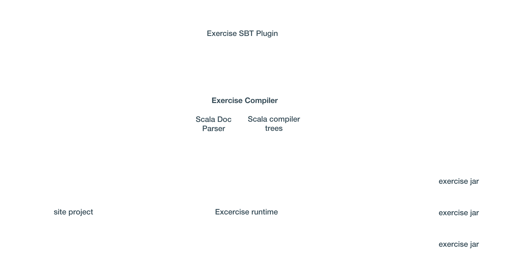

build-lists: true

---

# What is it?

- An Open Source (ASL2) Browser based App conceived to help you learn an understand Scala based libraries and frameworks

---

# History & Motivation

- @rafaparadela JS POC for the @47deg labs
- v1 Went Live on March 2nd, 2015
- Focused on porting the Scala Koans koans to the web
- Social component

---

# V1 Limitations

- Serverless
- Evaluation constrained to exact matches
- Can't track user progress across devices
- Can't parse or evaluate more complex exercises

---

# V1 Stats

- 63K sessions
- 40% Returning
- 180 PRs
- 50 Contributors
- 1 section completed per visit

---

# What's new?

---

# Libs at a glance

---

# Overall User Progress

---

# Library progress

---

# Write Exercises Coding!

---

---

---

---

---

# Exercises content are artifacts 

[Image here]

---

# Real evaluation of exercises

---

# Contributors are properly credited

---

Compiler / Evaluator / Architecture

---

---

# Purely Functional Architecture

[Image here]

--- 

# Warning! V2 is under Heavy Development!

---

# Actively working on...

- Improved evaluation
- Support for block style exercises (Ex : Implement a type class)
- Docs, contribution guide...
- Splitting into multiple repositories

--- 

# What would be coming next?

- Allow Github organizations ?
- Support other Exercises Format 
- It really is entirely up to you!

---

# What would be coming next?

- Top level domain / org
- Allow Github organizations ?
- Support other Exercises Format 
- It really is entirely up to you!

---

---

# Thanks!

@raulraja 
@47deg
Code : https://github.com/47deg/scala-exercises
V1 : http://scala-exercises.47deg.com

---
