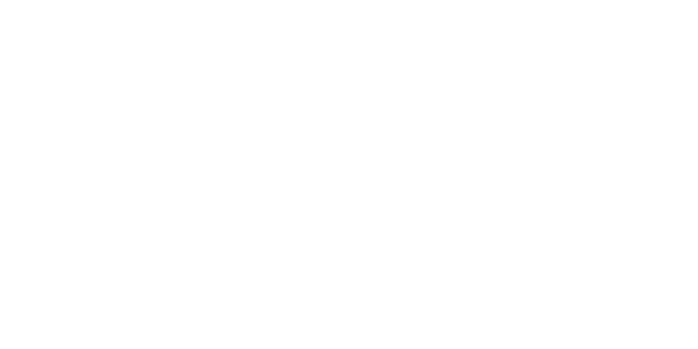

build-lists: true

---

*What is it?*

A browser tool to learn __Scala__ and its coolest __libs__

---

*A bit of History*

- @rafaparadela JS POC for the @47deg labs
- V1 Went Live on March 2nd, 2015
- Focused on porting the Scala Koans koans to the web
- Social component

---

*V1 Limitations*

- Serverless
- Evaluation constrained to exact matches
- Can't track user progress across devices
- Can't parse or evaluate more complex exercises

---

*V1 Stats*

- *63K* sessions
- *40%* Returning
- *180* PRs
- *50* Contributors
- *1* section completed per visit

---

# What's new in **V2**?

---

*Libs at a glance*

---

*Overall Progress*

---

*Lib Progress*

---

Write Exercises *Coding!*

---

Write Exercises *Coding!*

---

Write Exercises *Coding!*

---

Write Exercises *Coding!*

---

Write Exercises *Coding!*

*Real evaluation of exercises*

---

*Contributors are properly credited*

---

*We want you to become one of us!*

---

*Exercises Compiler Architecture*

---

*Technologies*

- **Client** [ScalaJS, Cats]
- **Server** [Play, Cats, Doobie]

---

*Client Architecture*

---

*Backend Architecture*

---

*Backend Architecture*

---

*Backend Architecture*

---

*Backend Architecture*

---

*Backend Architecture*

---

*Warning!* V2 is under Heavy Development!

---

*Actively working on...*

- Improved evaluation / Fork evaluation (Finch)
- Support for block style exercises (Ex : Implement a type class)
- Docs, contribution guide...
- Splitting into multiple repositories

--- 

*What would be coming next?*

- Allow Github organizations ?
- Support other Exercises Format 
- Top level domain / org
- It really is entirely up to you!

---

*Thanks!*

@raulraja 
@47deg

*Code* : https://github.com/47deg/scala-exercises
*V1* : http://scala-exercises.47deg.com
