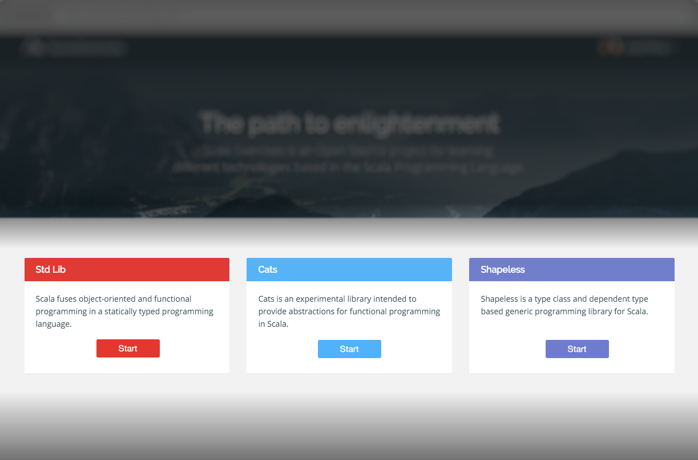
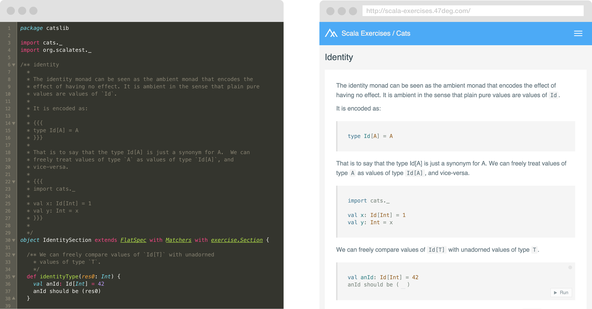
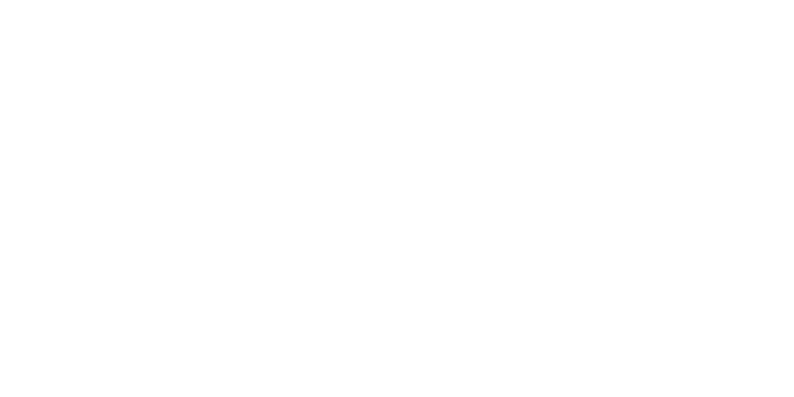

build-lists: true
footer: Scala Exercises @raulraja @47deg *V2*
slidenumbers: true


scala-exercises.org

---

*What is it?*

A browser tool to learn __Scala__ and its coolest __libs__

---

*A bit of History*

- @rafaparadela JS POC for the @47deg labs
- V1 Went Live on March 2nd, 2015
- Focused on porting Scala Koans to the web
- Social component

---

*V1 Limitations*

- Serverless
- "Evaluation" constrained to exact string matches
- Can't track user progress across devices
- Can't parse or evaluate more complex exercises

---

*V1 Stats*

- *63K* sessions
- *40%* Returning
- *180* PRs
- *50* Contributors
- *1* section completed per visit

---

*V2 Stats*

- Launched July 1st
- +3K Users
- +200 PRs closed
- +110K Evaluations so far
- Typelevel Project

---

# What's new in **V2**?

---

*Libs at a glance*



---

*Overall Progress*


---

*Lib Progress*


---

Write Exercises *with Code!*



---

Write Exercises *with Code!*


---

Write Exercises *with Code!*


---

Write Exercises *with Code!*


---

Write Exercises *with Code!*

*Real evaluation of exercises*


---

*Contributors are properly credited*


---

*Exercises Compiler Architecture*


---

*Technologies*

- **Client** [ScalaJS, Cats]
- **Server** [Play, Cats, Doobie, Monix]
- **Evaluator** [Http4s, Cats, Circe, Coursier]

---

*Client Architecture*


---

*Backend Architecture*



---

*Backend Architecture*


---

*Backend Architecture*


---

*Backend Architecture*


---

*Backend Architecture*


---

*Remote Evaluation*

Request

```json
{  
   "resolvers":[  
      "https://oss.sonatype.org/content/repositories/releases"
   ],
   "dependencies":[  
      {  
         "groupId":"org.typelevel",
         "artifactId":"cats-core_2.11",
         "version":"0.4.1"
      }
   ],
   "code":"{import cats._; Monad[Id].pure(42)}"
}
```

---

*Remote Evaluation*

Response

```json
{
  "msg": "Ok",
  "value": "42",
  "valueType": "java.lang.Integer",
  "compilationInfos": {}
}    
```

---

*Remote Evaluation*

Response

```json
{
  "msg": "Compilation Error",
  "value": null,
  "valueType": null,
  "compilationInfos": {
    "ERROR": [
      {
        "message": "value x is not a member of cats.Monad[cats.Id]",
        "pos": {
          "start": 165,
          "point": 165,
          "end": 165
        }
      }
    ]
  }
}
```

---

*New libraries being added...*

-  doobie > _a pure functional JDBC layer for Scala_

-  scalacheck > _Property-based testing for Scala_

-  fpis > _Functional Programming in Scala (Red Book)_

-  circe > _JSON library for Scala_

--- 

*Many ways to contribute*

- Write exercises for your library (Template available)
- Write exercises for libs you are using or learning about
- Improve Documentation
- Improve Evaluator Security
- Fix bugs

--- 

*Actively working on...*

- Improved evaluation exercises
- Support for block style exercises (Ex : Implement a type class)
- Docs, contribution guide...
- Line errors

--- 

*What would be coming next?*

- Allow Github organizations 
- Display Platform, Section and Exercise Statistics for repo owners
- Export / Import / Run Github Gists
- Support other Exercises Format (tut)
- Any ideas?

---

*Thanks!*

[@raulraja](https://twitter.com/raulraja)

[@47deg](https://twitter.com/47deg)

Github : https://github.com/scala-exercises
