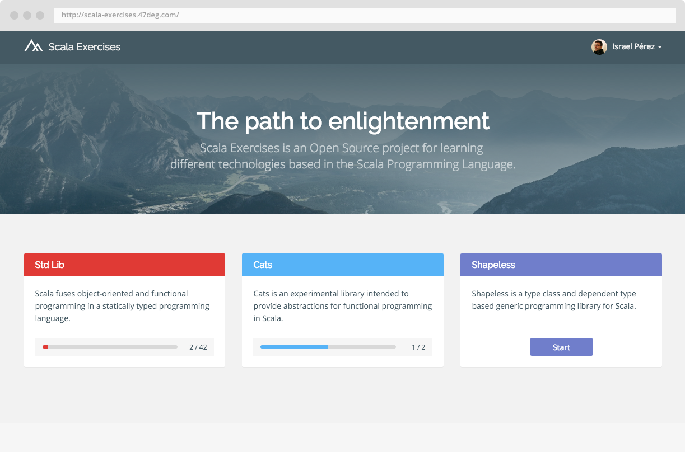

# Scala Exercises v2

---

# What is Scala Exercises?

- An Open Source (ASL2) Browser based App conceived to help you learn an understand Scala based libraries and frameworks

---

# V1 : History & Motivation

* @rafaparadela JS POC for the @47deg labs
* Went Live on March 2nd, 2015
* Focused on porting @dickwall and other's koans to the web
* Scala koans was originally inspired by the Ruby Koans

---

# V1 : History & Motivation

* Social and Community component
* Rafa to add more of his speech
---

# V1 : Limitations

* Serverless
* Evaluation constrained to exact matches
* Can't track user progress across devices
* Can't parse or evaluate more complex exercises

---

# V1 : Stats

* ~63K sessions
* 40% Returning
* ~180 PRs
* ~50 Contributors
* ~ 1 section completed per visit

---

# V2 : Warning!

## V2 is under Heavy Development!

---

# V2 : What's new?

## Libs at a glance

---

# V2 : What's new?

## Overall User Progress

---

# V2 : What's new?

## Library progress

---

# V2 : What's new?

A new an improved way to create exercises

---

# V2 : What's new?

A new an improved way to create exercises

---

# V2 : What's new?

A new an improved way to create exercises

---

# V2 : What's new?

Exercises content are artifacts 

---

# V2 : What's new?

Real evaluation of exercises

---

# V2 : What's new?

Contributors are properly credited

---

# V2 : What's new?

An emphasis on content for Typelevel-like libs

---

# V2 : Internals

Compiler / Parser / Evaluator

---

# V2 : Internals

- `cats.free.Free` based architecture
- `doobie` Persistence
- Testing with ScalaCheck and ScalaTest

--- 

# V2 : In flight

- Improved evaluation
- Support for block style exercises (Ex : Implement a type class)
- Docs, contribution guide...

--- 

# V3 : What's next after V2?

- Allow Github organizations ?
- Support other Exercises Format (Tut?)

--- 

